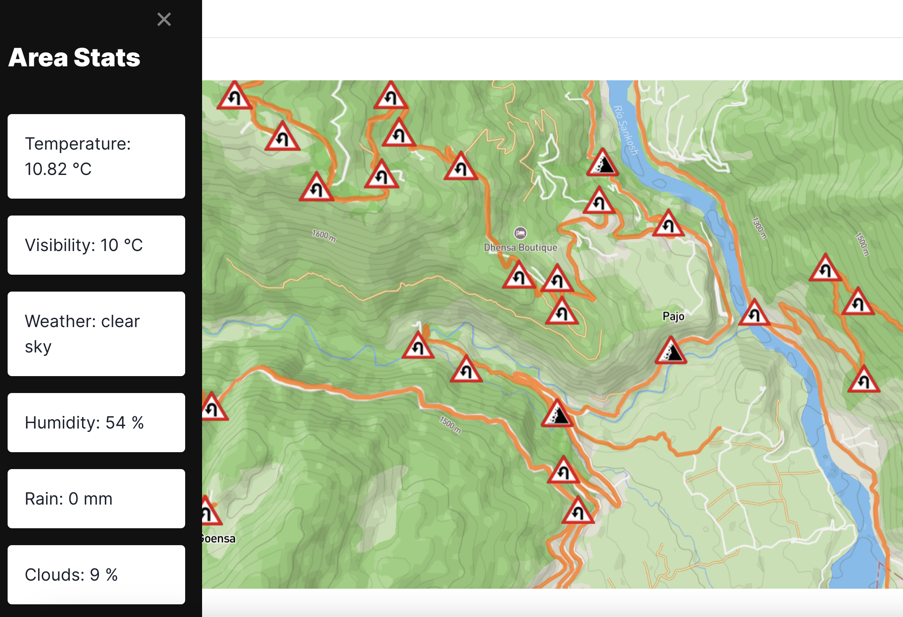

# Gari

Gari is a web application that generates a map of roads in Bhutan highlighting areas with sharp turns and steep slopes.
Open [http://localhost:3000](http://localhost:3000) to view it in the browser.

The web app was developed using next js framework and mainly uses react, mapbox, openweather-api, and chakra ui. The data for the routes was collected from this [2016 Road Data](https://maps.princeton.edu/catalog/stanford-sn068jx1590) and the logic to find curves was derived from this [repo](https://github.com/MaikeruDev/RiskyRoads). The news articles for accidents was webscraped from [BBS](http://www.bbs.bt/news/) using BeautifulSoup, spacy and pandas. The accident data provided the idea of how highly frequent was the accodent cases of cars veering off road. The slopes was identified using the Google Earth Engine Python API, where a buffer was created around the roads, and in clusters of this region, the mean slope of the area was calculated. If the slope was greater than 25 degress, the area was flagged as a risky area for landslide.

The reason why I created Gari was due to the alarming number of incidents where a vehicle veered off the road and I felt that this issue had to be addressed more. Although most of this could be attributed to the drivers from drinking, speeding or reckless driving, there could also be other external factors such as the condition of the vehicle, roads, weather and environment. Regardless of the causes, regions with sharp turns and areas of steep slops are high-risk zones which should have guardrails put in places as [studies](https://www.sciencedirect.com/science/article/pii/S0001457514001869) show that guardrails and other barriers can reduce fatalities.

In terms of extension, this would serve as a complement to navigation apps like google maps as currently the area stats are only derived from a default location, but idealy the users current location would be tracked.Also this system would anable you to make a detailed entry if any accidents occur or you observe any as there is a lack of data on locations of past car accidents to better understand patterns in the landscape, climate and geography of these locations to identify potential high-risk zones for drivers. These locations can be prioritized first during projects involving road renovation. Better road infrastructure also would enhance economic development, accessibility and connectivity.
